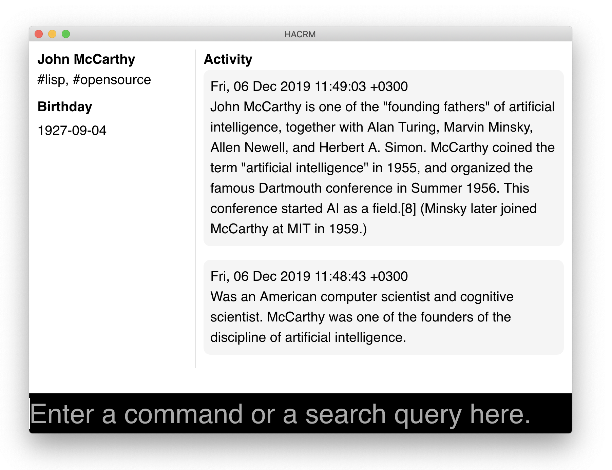

======================
 HACRM - Hacker's CRM
======================

.. warning:: This is a prototype and most probably it will not work
             for you. But you can try.

How to test desktop app
=======================

Build it
--------

::

  brew install roswell node
  ros install fukamachi/qlot
  npm install electron-packager -g
  ./build.sh

It should end with something like that::

  compressed 0 bytes into 8 at level -1
  compressed 32768 bytes into 441 at level -1
  compressed 78675968 bytes into 15544505 at level -1
  compressed 1736704 bytes into 458235 at level -1
  compressed 26902528 bytes into 8123577 at level -1
   <INFO> [10:50:32] ros.script.ceramic ceramic.ros (main run) - COMMAND: "electron-packager /Users/art/projects/lisp/hacrm/js-app/ --overwrite --platform darwin --electron-version 1.2.7 --executable-name app --icon icon.icns hacrm"
  Packaging app for platform darwin x64 using electron v1.2.7
  Wrote new app to /Users/art/projects/lisp/hacrm/hacrm-darwin-x64
  Downloading tmp-18924-0-electron-v1.2.7-darwin-x64.zip
  [============================================>] 100.0% of 42.74 MB (5.89 MB/s)
   <INFO> [10:50:45] ros.script.ceramic ceramic.ros (main run) - COMMAND: "mv hacrm-darwin-x64/hacrm.app/Contents/MacOS/app hacrm-darwin-x64/hacrm.app/Contents/MacOS/Electron"
   <INFO> [10:50:45] ros.script.ceramic ceramic.ros (main run) - COMMAND: "cp app hacrm-darwin-x64/hacrm.app/Contents/MacOS/"
   <INFO> [10:50:45] ros.script.ceramic ceramic.ros (main run) - COMMAND: "cp -r js-app/node_modules/ws hacrm-darwin-x64/hacrm.app/Contents/Resources/app/node_modules/"

Then run it
-----------

::

  hacrm-darwin-x64/hacrm.app/Contents/MacOS/app --debug

Hooks
=====

HaCRM uses "hooks" to enable plugins to add a code to be executed
on particular events.

TODO: Add an example how hook should be called and how new handler
should be added to a callback's list.

:feed-item-created
------------------

Called when new feed item was created. This could be a new note, or
an email, or tweet, etc.
